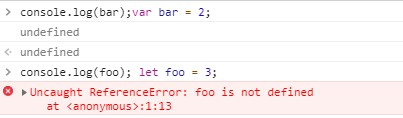

---
[MENU]
typora-copy-images-to: imgs
---

# ES6标准入门

[TOC]

## 1、let 和const

### 1.1、let命令

- **基本用法**

```
{
  let a = 10;
  var b = 1;
 }

 console.log(a);	//ReferenceError
 console.log(b);	// 1
```


```
var a = [];
for(let i = 0; i < 10; i++) {
  a[i] = function() {
    console.log(i);		 
  }
}

a[6]();		//6
```

​	在上面代码中,如果使用var关键字，最后的结果输出10，原因是：var关键字声明为全局变量，因此全局只有一个变量i，而循环内部，被赋给数组a的函数内部的i指向的是全局的i 。即所有数组a的成员中的i指向的都是同一个。如果使用的是let，声明变量仅在快作用域内有效，因此最后输出6。

- **FAQ**

  Q：如果每一轮的循环变量的i都是重新声明的，那它怎么知道上一轮循环的值从而计算出本轮循环的值呢？

  A：JavaScript引擎内部会记住上一轮循环的值，初始化本地变量i时，就在上一轮循环的基础上进行计算

  for循环的特性：设置循环变量的那部分是一个副作用域，而循环体内部是一个单独的子作用域

  ```
  for (let i = 0; i < 3; i++) {
    let i = 'abc';
    console.log(i);
  }
  // abc
  // abc
  // abc
  ```

  正确运行以上代码将输出3次abc，这表示函数内部的变量i与循环变量i不在同一个作用域，而是有各自单独的作用域。

- **不存在变量提升**

  var命令会存在“变量提升”现象，即变量可以在声明之前使用，值为undefined。

  let命令改变了语法行为，它所声明的变量一定要在声明之后使用：

  

 - **暂时性死区**

   ES6明确规定，如果区块中存在let和const命令，则这个区块对这些命令声明的变量从一开始就形成封闭的作用域。

   只要在声明之前就使用这些变量，就会报错。


   ```
   if(true) {
     // TDZ开始
     tmp = 'abc';  // ReferenceError
     console.log(tmp);   // ReferenceError
   
     let tmp; // TDZ结束
     console.log(tmp); // undefined
   
     tmp = 123;
     console.log(tmp);   // 123
   }
   ```

   总之，在代码块内，只用let命令声明变量之前，该变量都是不可用的。这在语法上称为“暂时性死区”（TDZ）。

   本质:

   ​	只要进入当前作用域，所要使用的变量就已经存在，但是不可获取，只有等到声明变量的那一行代码出现，

   才可以获取和使用该变量。

- **不允许重复声明**

  let不允许在相同的作用域内重复声明同一个变量。

### 1.2、块级作用域

- **为什么需要**

  1、内层变量可能会覆盖外层变量

  ```
  var test = new Date();
  
  function f() {
    console.log(test);
    if (false) {
      var test = 'Hello World';
    }
  }
  
  f();  // undefined
  ```

  2、用来计数的循环变量泄漏为全局变量

  ```
  var s = "Hello World!";
  for(var i = 0;  i < s.length; i++) {
    console.log(s[i]);
  }
  
  console.log(i); // 12
  ```

- **ES6的块级作用域**

  let实际上为JavaScript新增了块级作用域。

  ```
  (function f1() {
    let c = 5;
    if(true) {
      let c = 10;
    }
    console.log(c);   // 5
  })();
  ```

  1、ES6允许块级作用域的任意嵌套

  2、外层作用域无法读取内层作用域的变量

  3、内层作用域可以定义外层作用域的同名变量

- **块级作用域与函数声明**

  ES6引入了块级作用域，明确允许在块级作用域中声明函数。ES6规定，在块级作用域之中，函数声明语句的行为

  类似于let，在块级作用域之外不可引用。

  ```
  function f() {
    console.log('I am outside');
  }
  
  (function () {
    if(false) {
      function f() {
        console.log('I am inside');
      }
    }
    f();
  }());
  ```

  ES5:  I am inside

  ES6:  I am outside(理论上)

  实际上ES6运行以上代码报错：TypeError: f is not a function

  原因：为了浏览器兼容问题，浏览器的实现可以不遵照上面的规定，可以有自己的行为方式，具体如下：

  1、允许在块级作用域内声明函数

  2、函数声明类似于var，即会提升到全局作用域或函数作用域的头部

  3、函数声明还会提升到所在块级作用域的头部。

  notes:

  1、块级作用域允许声明函数的规则只在使用大括号的情况下成立，

  2、考虑到环境导致的行为差异太大，应该避免在块级作用域内声明函数。如果确实需要，也应该写成函数表达式的形式，而不是函数声明语句。

  ```
  //  函数声明语句
  {
    var a = 'secret';
    function f() {
      return a;
    }
  }
  
  // 函数表达式
  {
    let a = 'secret';
    let f = function() {
      return a;
    }
  }
  ```

- **do表达式**

  ```
  let x = do {
    let t = f();
    t * t + 1;
  }
  ```

  变量x会得到整个块级作用域的返回值。（提案）

### 1.3、const命令

- **基本用法**

  const声明一个只读的常量。一旦声明，常量的值就不能改变。

  1、const声明的常量不得改变值

  2、一旦声明常量，就必须立即初始化，不能留到以后赋值

  3、作用域与let命令相同：只在声明所在的块级作用域内有效（不会提升，同样存在暂时性死区，只能在声明后使用；不可重复声明）

  ```
  const PI = 3.1415;
  console.log(PI); // 3.1415
  ```

- **本质**

  const实际上保证的并不是变量的值不得改动，而是变量指向的那个内存地址不得改动。

  简单类型（数值、字符串、布尔值），值就保存在变量指向的内存地址中，因此等同于常量

  复合类型（对象和数组）：变量指向的内存地址保存的是一个指针，const只能保证这个指针是固定的，它指向的数据结构是可变的。

  ```
  const obj = {};
  
  obj.name = 'Jack';
  console.log(obj);   //{ name: 'Jack' }
  
  obj = [];   // TypeError: Assignment to constant variable.
  ```

  将对象本身以及对象的属性冻结的例子：

  ```
  var constantize = (obj) => {
    Object.freeze(obj);
    Object.keys(obj).forEach( (key, i) => {
      if ( typeof obj[key] === 'object' ) {
        constantize( obj[key] );
      }
    });
  };
  ```

- **ES6声明变量的6种方法**

  var、function、let、const、import、class

### 1.4、顶层对象的属性

从ES6开始，全局变量将逐步与顶层对象的属性隔离

```
var a = 1;
console.log(window.a);  // 1

let b = 1;
console.log(window.b);  // undefined
```

Note:

​	ES6一方面规定，为了保持兼容性，var命令和function命令声明的全局变量依旧是顶层对象的属性；另一方面规定，let、const、class命令声明的全局变量不属于顶层对象的属性。

## 2、变量的解构赋值

### 2.1、数组的解构赋值

- **基本用法**


